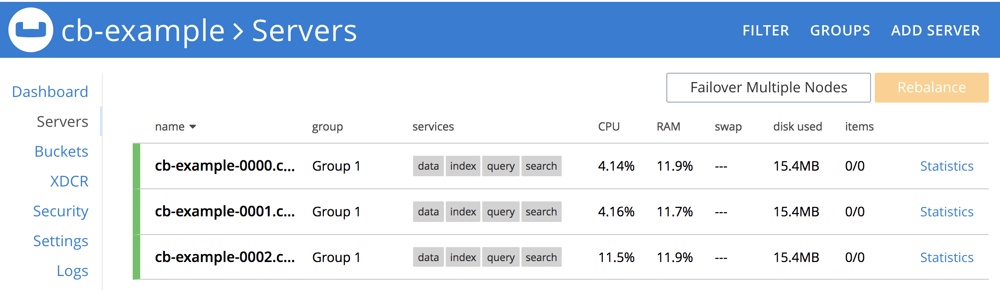
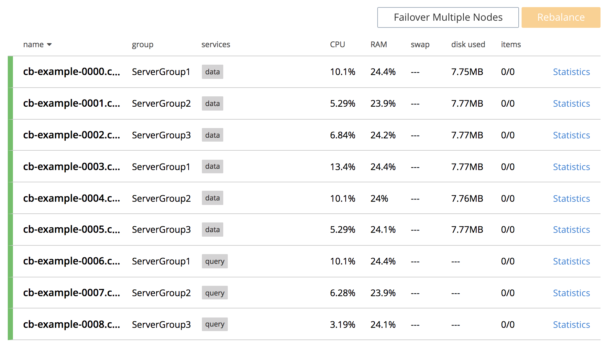

# Couchbase Operator For OpenShift

The Couchbase Operator allows users to deploy Couchbase on OpenShift while significantly reducing the operational complexities typically association with managing and scaling databases.

Related resources:

- **TODO:** insert the most relevant docs and blog links

## Summary 

This is a guide for running the Couchbase Operator demo on Red Hat OpenShift - [Partner Demo System](https://www.redhat.com/en/partners/rhpds)

### Pre-requisites

- Admin access to the PDS environment (required to install [CRDs](https://blog.openshift.com/kubernetes-custom-resources-grow-up-in-v1-10/))


### High Level Demo Steps

*oc cli = OpenShift Command Line (oc), oc ui = OpenShift UI, cb ui = Couchbase UI*


- **Operator and Cluster Deployment**
	- oc cli: Login to OpenShift (as admin) 
	- oc cli: Deploy the Couchbase Operator CRD 
	- oc cli: Create service accounts, roles, bindings
	- oc cli: Deploy the Couchbase Operator
	- oc cli: Deploy a Couchbase Cluster
	- cb ui: Expose a route to the Couchbase Cluster and login to Couchbase UI
- **Failover and Rebalance**
	- oc ui: Login to OpenShift UI
	- cb ui: Load some data into default bucket (TBD)
	    - Show bucket contents
	- oc ui: Delete some pods
   - oc ui: Show pods disappearing and new ones being created
   - cb ui: Show Couchbase failing over, recovering with new node and rebalancing.
- **Server Groups**
	- Delete the basic Couchbase cluster (cluster only, keep operator)
    - Add labels to the OpenShift nodes (required to support server groups)
	- Deploy the Couchbase cluster w/ Server Groups enabled
- **PersistentVolumes**
    - TBD
- **Cross-data Center Replication "Lift & Shift"**
    - TBD


## PDS Operator Demo Commands

All yaml in this directory was initially pulled from https://packages.couchbase.com/kubernetes/0.9.0-beta3/openshift/*.yaml

These commands are for deploying the entire demo from scratch on a 3 node PDS cluster.

### Open Shift UI Login

https://master.couchbase.openshiftworkshop.com/login

- 2 Accounts
    - developer: user1 / openshift
    - admin: opentlc-mgr / r3dh4t1!

### Login and Create Project

```
oc login https://master.couchbase.openshiftworkshop.com
```
Login as admin from command line:

opentlc-mgr / r3dh4t1!

```
oc new-project operator-example
```

### Deploy the Opertor CRD

```
oc create -f crd.yaml
```

### Create Roles, Accounts & Bindings

```
oc create -f cluster-role-sa.yaml
oc create -f cluster-role-user.yaml

oc create serviceaccount couchbase-operator --namespace operator-example

oc create rolebinding couchbase-operator --clusterrole couchbase-operator --serviceaccount operator-example:couchbase-operator

oc adm policy add-scc-to-user anyuid system:serviceaccount:operator-example:couchbase-operator

oc create rolebinding couchbasecluster --clusterrole couchbasecluster --user developer --namespace operator-example

oc create clusterrolebinding couchbasecluster --clusterrole couchbasecluster --user developer

```

### Deploy the Operator

```
oc create -f operator.yaml
```

After < 1 minute you should be able to see the operator running:

```
oc get pods
NAME                                  READY     STATUS    RESTARTS   AGE
couchbase-operator-5bc785c54f-kh6c2   1/1       Running   0          22s
```

### Deploy Couchbase Credentials

The clusters we will create leverage the credentials provided in this secret.

```
oc create -f secret.yaml
```


### Deploy a Basic Couchbase Cluster

The first cluster that we'll deploy will be a simple, 3 node cluster

```
oc create -f cluster.yaml
```

You should start seeing Couchbase pods appearing immediately. It will take a couple of minutes for the cluster to be ready.

```
oc get pods
NAME                                  READY     STATUS    RESTARTS   AGE
cb-example-0000                       1/1       Running   0          3m
cb-example-0001                       1/1       Running   0          3m
cb-example-0002                       1/1       Running   0          2m
couchbase-operator-5bc785c54f-kh6c2   1/1       Running   0          7m
```

### Expose the Couchbase UI

Next, expose the Couchbase UI so you can log into it:

```
oc expose service/cb-example-ui
```

Get the route to the Couchbase UI:

```
oc get routes
NAME            HOST/PORT                                               PATH      SERVICES        PORT        TERMINATION   WILDCARD
cb-example-ui   cb-example-ui-operator-example.xxx.xxx.xxx.xxx.xip.io             cb-example-ui   couchbase                 None
``` 

Open the URL outputted by `oc get routes` in your browser and login with "Administrator/password". Navigate to "Servers" to see the server list.

You should see this:



### Load Data

**TODOD**


### Failover Demo

Now that we have a cluster up and some data, we can demonstrate the operator in action. 

First, delete one of the pods

```
oc delete pod cb-example-0002
```

Show the Couchbase server list page while this happens.

### Server Groups Demo

First, we need to add labels to our OpenShift nodes. Labels are used to tell the Operator which zone a particular node belongs to. In this example, we'll simulate each node beloning to a separate zone (hence each node gets it's own ServerGroup label)

```
 oc label --overwrite nodes node1.couchbase.internal server-group.couchbase.com/zone=ServerGroup1
 oc label --overwrite nodes node2.couchbase.internal server-group.couchbase.com/zone=ServerGroup1
 oc label --overwrite nodes node3.couchbase.internal server-group.couchbase.com/zone=ServerGroup2
 oc label --overwrite nodes node4.couchbase.internal server-group.couchbase.com/zone=ServerGroup2
```

Now, delete the existing Couchbase cluster:

```
oc delete -f cluster.yaml
```

Also, clean up the route we exposed earlier:

```
oc delete route cb-example-ui
```

Run `oc get pods` to make sure all of the pods have been destroyed. Now deploy the new cluster:

```
oc create -f cluster-server-groups.yaml
```

This deploys a 9 node cluster with ServerGroups enabled. The distribution of nodes is setup so that each zone has 2 Data nodes and 1 Query node. This allows us to keep 2 replicas of the defauly bucket in each zone.


