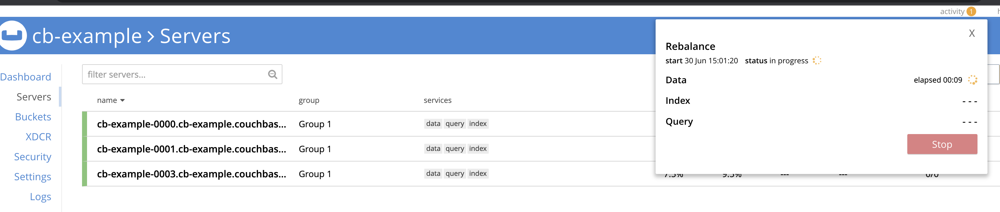

# Couchbase Operator For OpenShift

The Couchbase Operator allows users to deploy Couchbase on OpenShift while significantly reducing the operational complexities typically association with managing and scaling databases.

Related resources:

- [Autonomous Operator Overview](https://docs.couchbase.com/operator/1.0/overview.html)
- [Installing on OpenShift](https://docs.couchbase.com/operator/1.0/install-openshift.html)
- [Red Hat Partner Demo System](https://rhpds.redhat.com/)

## Summary

This guide is intended to be run with with Red Hat's OpenShift Workshop on [RHPDS (Partner Demo System)](https://rhpds.redhat.com/) for demos and workshops. It provides steps and examples for deploying Couchbase clusters using the Autonomous operator.

All of these steps can also be run on Minishift or any other supported OpenShift environment (tested on 3.10 and 3.11). Just replace the URLs in the steps below with the address to your environment. Throughout this guide you will see references to `CLUSTER_ID`. This ID is different each time a PDS cluster is created. Please reach out to partners@couchbase.com if you need access to a cluster, and a complete URL with `CLUSTER_ID` will be provided.

# Setup

### Login to Red Hat OpenShift Container Platform

The first step is to login to OpenShift from your local browser AND terminal.

Open https://master.couchbase-<CLUSTER_ID>.openshiftworkshop.com/login in your browser and login:

- username: opentlc-mgr
- password: r3dh4t1!


Now we will login via terminal using the same credentials:

```
oc login https://master.couchbase-<CLUSTER_ID>.openshiftworkshop.com --insecure-skip-tls-verify
```


> Note: opentlc-mgr is a cluster admin account. Clustera dmin privileges are needed in order to install Custom Resource Definitions (CRDs). Cluster admin privileges are not required for subsequent steps.

### Create Project

Next, we need to create a project.

```
oc new-project operator-example
```

This command creates the `operator-example` project and switches to it.

### Deploy the Operator Custom Resource Definition

```
oc create -f crd.yaml
```

The CRD extends the Kubernetes API on the cluster to support the Couchbase Operator. Read more about [Custom Resources](https://kubernetes.io/docs/concepts/extend-kubernetes/api-extension/custom-resources/)


### Create Roles, Accounts & Bindings

```
oc create -f cluster-role-sa.yaml
oc create -f cluster-role-user.yaml

oc create serviceaccount couchbase-operator --namespace operator-example

oc create rolebinding couchbase-operator --clusterrole couchbase-operator --serviceaccount operator-example:couchbase-operator

oc adm policy add-scc-to-user anyuid system:serviceaccount:operator-example:couchbase-operator

oc create rolebinding couchbasecluster --clusterrole couchbasecluster --user developer --namespace operator-example

oc create clusterrolebinding couchbasecluster --clusterrole couchbasecluster --user developer

```

This creates the user, roles, and bindings that the Operator and Couchbase nodes run under.


### Create Red Hat Registry Secrets

Before we can deploy the operator we need to specify credentials for pulling container images from Red Hat's registry and add them to the service accounts.

```
oc create secret docker-registry rh-catalog --docker-server=registry.connect.redhat.com --docker-username=redcouch --docker-password=openshift --docker-email=redcouchredhat@gmail.com

oc secrets add serviceaccount/couchbase-operator secrets/rh-catalog --for=pull
oc secrets add serviceaccount/default secrets/rh-catalog --for=pull
```
> Note the image will be pulled from the registry into the cluster's local repository. 

### Deploy the Operator

```
oc create -f operator.yaml
```

After < 1 minute you should be able to see the operator running:

> Note your pods name is partially random, you will have a different name.

```
oc get pods -w
NAME                                  READY     STATUS    RESTARTS   AGE
couchbase-operator-5bc785c54f-kh6c2   1/1       Running   0          22s
```

**Do not proceed** to the next step until you see the `couchbase-operator` pod has status `RUNNING`. You can use the `-w` flag to see status changes. Hit `ctrl + C` to escape.

### Deploy Couchbase Credentials Secret

The Couchbase clusters deployed in the following steps will use the credentials provided in the `cb-example-auth` secret. Deploying `secret.yaml` will create the secret.

```
oc create -f secret.yaml
```

# Cluster Recipes

### Deploy a Basic Couchbase Cluster

The first cluster that we'll deploy will be a simple, 4 node cluster, with one bucket and 2 replicas.

```
oc create -f cluster-basic.yaml
```

You should start seeing Couchbase pods appearing immediately. It will take a couple of minutes for the cluster to be ready.

```
oc get pods -w
NAME                                  READY     STATUS    RESTARTS   AGE
cb-example-0000                       1/1       Running   0          3m
cb-example-0001                       1/1       Running   0          3m
cb-example-0002                       1/1       Running   0          2m
cb-example-0003                       1/1       Running   0          2m
couchbase-operator-5bc785c54f-kh6c2   1/1       Running   0          7m
```
> Remember to hit `ctrl + c` to escape.

### Expose the Couchbase UI

Next, expose the Couchbase UI so you can log into it:

```
oc expose service/cb-example-ui
```

Get the route to the Couchbase UI:

```
oc get routes
NAME            HOST/PORT                                                             PATH      SERVICES        PORT        TERMINATION   WILDCARD
cb-example-ui   cb-example-ui-operator-example.apps.couchbase-<CLUSTER_ID>.openshiftworkshop.com             cb-example-ui   couchbase                 None
```

Open the URL outputted by `oc get routes` in your browser and login with:
> Username: Administrator
> Password: password. 

Navigate to "Servers" to see the server list:


On the Pods page in OpenShift (https://master.couchbase-<CLUSTER_ID>.openshiftworkshop.com/console/project/operator-example/browse/pods):


### Build and Deploy an App


> Note: in order to follow this section, you will need a twitter developer account. If you do not have an account, please contact evan.pease@couchbase.com and I will provide temporary credentials.

In order to help demonstrate the Couchbase Autonomous Operator in action, we'll deploy a simple real-time analytics application that ingests tweets from Twitter's API into Couchbase. We will then simulate a node failure and observe how the application and Couchbase respond.

The application is made up of 3 microservices:

1. Tweet Ingester Service - The tweet ingester is a Java application that consumes tweet in real-time from Twitter's APIs into Couchbase.
2. API Service - The API service is Java application that provides several REST end points for exposing data ingested by the Tweet Ingester Service. Under the hood, it is running SQL queries against Couchbase.
3. UI Service - The UI service is a simple Node server that serves a React SPA (single page application). The UI provides visualizations of the data provided by the API Service.

#### S2I Setup for Java Applications

First, import the `openjdk18-openshift` image. This is a S2I (source to image) builder. [S2I](https://access.redhat.com/documentation/en-us/red_hat_jboss_middleware_for_openshift/3/html-single/red_hat_java_s2i_for_openshift/index) will allow us to containerize and deploy an application on OpenShift without having to worry about writing a Dockerfile nor any yaml files!

```
oc import-image registry.access.redhat.com/redhat-openjdk-18/openjdk18-openshift --confirm
```

After importing this image, we'll be able to deploy Java applications straight from source code using Open Shift's `new-app` command.


#### Deploy the API Service

First, we'll deploy the API service.

```
oc new-app registry.access.redhat.com/redhat-openjdk-18/openjdk18-openshift:latest~https://github.com/couchbase-partners/redhat-pds.git \
       -e COUCHBASE_CLUSTER=cb-example \
       -e COUCHBASE_USER=Administrator \
       -e COUCHBASE_PASSWORD=password \
       -e COUCHBASE_TWEET_BUCKET=tweets \
       --context-dir=cb-rh-twitter/twitter-api \
       --name=twitter-api
```

You can watch the build process by running `oc logs -f bc/twitter-api`. Once this is completed it will deploy a pod running the API service.

Now let's expose the API service so it is accessible publicly:

```
oc expose svc twitter-api
```

This should create a route to http://twitter-api-operator-example.apps.couchbase-<CLUSTER_ID>.openshiftworkshop.com. Open the URL http://twitter-api-operator-example.apps.couchbase-<CLUSTER_ID>.openshiftworkshop.com/tweetcount in your browser and you should see a number 0 in your browser. This is a simple API endpoint that returns the number of tweets ingested.

#### Deploy the UI Service

Next, we'll deploy the UI service. This service is a simple node server serving up a ReactJS app. For expediency, a Docker image is already built. We can also deploy Docker images directly with the `new-app` command:

```
oc new-app ezeev/twitter-ui:latest
```

This will deploy our UI service. Let's expose it so we can access it:

```
oc expose svc twitter-ui
```

This should expose a route to http://twitter-ui-operator-example.apps.couchbase-<CLUSTER_ID>.openshiftworkshop.com. Visit this link. You should see a dashboard load **with empty charts**. We will start populating them in the next step after deploying the Tweet Ingester Service.

Now, add the following request parameter to the URL in your browser: `?apiBase=<exposed route to API service>`. The complete URL should look like:

```
http://twitter-ui-operator-example.apps.couchbase-<CLUSTER_ID>.openshiftworkshop.com?apiBase=http://twitter-api-operator-example.apps.couchbase-<CLUSTER_ID>.openshiftworkshop.com
```


#### Deploy the Tweet Ingester Service

Now that we have our API and UI deployed, we are ready to start ingesting and visualizing twitter data! This is a Java application like the API service, so we will deploy it the exact same way:

```
oc new-app registry.access.redhat.com/redhat-openjdk-18/openjdk18-openshift:latest~https://github.com/couchbase-partners/redhat-pds.git \
       -e TWITTER_CONSUMER_KEY=YOUR_CONSUMER_KEY \
       -e TWITTER_CONSUMER_SECRET=YOUR_CONSUMER_SECRET \
       -e TWITTER_TOKEN=YOUR_TOKEN \
       -e TWITTER_SECRET=YOUR_SECRET \
       -e TWITTER_FILTER='#RegisterToVote' \
       -e COUCHBASE_CLUSTER=cb-example \
       -e COUCHBASE_USER=Administrator \
       -e COUCHBASE_PASSWORD=password \
       -e COUCHBASE_TWEET_BUCKET=tweets \
       --context-dir=cb-rh-twitter/twitter-streamer \
       --name=twitter-streamer
```

You can watch the build with `oc logs -f bc/cb-rh-twitter`. When this is completed you should see a new pod created for the twitter streamer.

At this point you should also see new documents appearing in the tweets bucket in Couchbase, and in the UI at http://twitter-ui-operator-example.apps.couchbase-<CLUSTER_ID>.openshiftworkshop.com/.

### Failover Demo

Now that we have a cluster up with some data, we can demonstrate the operator in action.

First, delete one of the pods:

```
oc delete pod cb-example-0003
```

By deleting the pod, we are destroying one of the Couchbase nodes. At this point the operator should take over and try to recover the cluster to our desired state.

Couchbase recognizes that a node is missing and triggers fail-over:


Couchbase recognizes the new node coming online and begins rebalancing:



The rebalance continues until the cluster is fully healed.


### Cleanup

Delete the cluster before moving onto the next example:

```
oc delete -f cluster-basic.yaml
```

To remove the twitter streaming app:

```
oc delete dc twitter-streamer
oc delete bc twitter-streamer
oc delete svc twitter-streamer
```

## Deploy a Cluster with Server Groups Enabled

First, we need to add labels to our OpenShift nodes. Labels are used to tell the Operator which zone a particular node belongs too. In this example, we'll declare the node1 and node2 belong to ServerGroup1. Our node2 and node3 will belong to ServerGroup2.

```
 oc label --overwrite nodes node1.couchbase.internal server-group.couchbase.com/zone=ServerGroup1
 oc label --overwrite nodes node2.couchbase.internal server-group.couchbase.com/zone=ServerGroup1
 oc label --overwrite nodes node3.couchbase.internal server-group.couchbase.com/zone=ServerGroup2
 oc label --overwrite nodes node4.couchbase.internal server-group.couchbase.com/zone=ServerGroup2
```

Now deploy the new cluster:

```
oc create -f cluster-server-groups.yaml
```

This deploys a 9 node cluster with ServerGroups enabled. The distribution of nodes is setup so that each zone has 2 Data nodes and 1 Query node. This allows us to keep 2 replicas of the default bucket in each zone.


